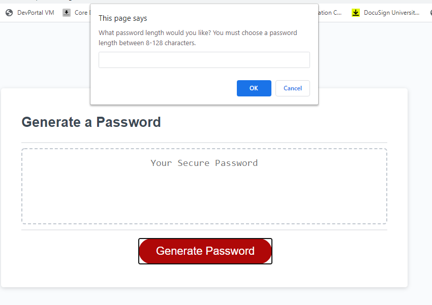

# Selma's HW3 Randomized Password Generator

## Description: 
In this activity we are building a password generator that is built from user input and selections. To start, the entire function should be activated when the user clicks (the event handler) the 'Generate Password' button. The user is being asked to pick a password length between 8-128 characters. That password must then have at least one set of criteria met for (lowercase, uppercase, special character, integer). Then the generator will spit out a final password generated with their selections. This is a very real world project, lots of times, companies will want to have a criteria for passwords and randomly generate that string when a user wants to reset their password for example. It's amazing to see how much work goes into something like this.

## A couple of things I learned in this:
* That variables don't necessarily need to equal anything, they can just be declared.
* That you need to account for every scenario that could happen so that you can control when your user is able to exit a while loop or stay stuck in it.
* I learned to use the operator +=

## Installation:
* If you need to pull my code for this homework, please visit my Github repository at: https://github.com/selma-e/hw3_password_generator
* If you want to see the final webpage for my code, please visit my hosted website at: https://selma-e.github.io/hw3_password_generator/

## Usage: 

## Resources Used/Credits:

* https://developer.mozilla.org/en-US/docs/Web/JavaScript/Reference/Global_Objects/isNaN
* https://developer.mozilla.org/en-US/docs/Web/JavaScript/Reference/Global_Objects/parseInt
* https://www.w3schools.com/js/js_operators.asp
* https://www.tutorialspoint.com/javascript/string_charat.htm

© 2020 Selma Elgabalawy | UW-SEA-FSF-PT-08-2020-U-C-TTh